# Let´s Draw
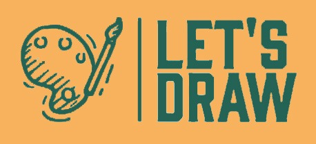
### -Juan Sebastian Garcia Hincapie
### -Juan Pablo contreras Amaya
### -Ricardo Amaya Rivera

## Descripción Básica

Es un juego multijugador en tiempo real, basado en el juego pictionary, el cual cuenta con un sistema de turnos, donde un jugador se encarga de dibujar una palabra especifica definida por el sistema y el resto de jugadores se encarga de adivinarla, mientras mas rápido se adivine, más puntos se obtienen.

## Diagramas
### casos de uso
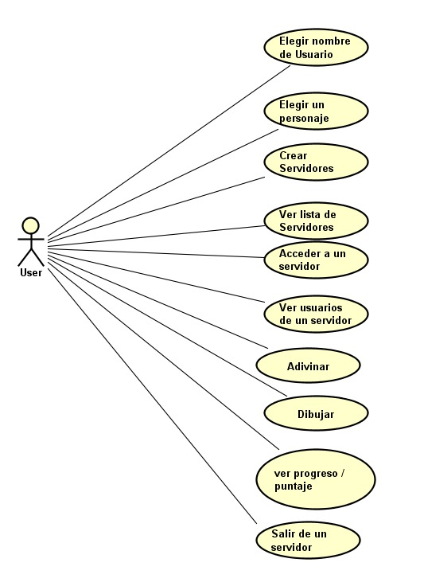
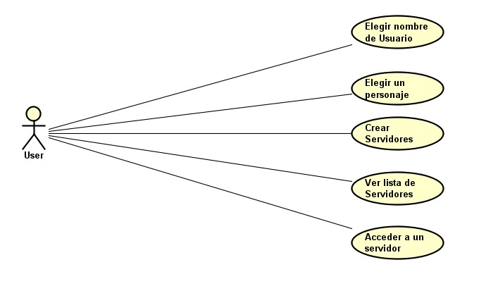

### diagrama de componentes
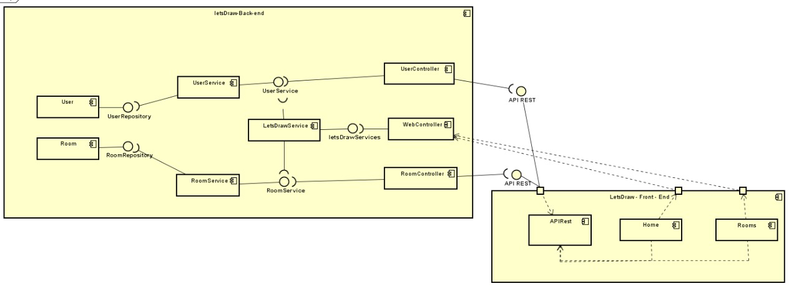

### diagrama de despliegue
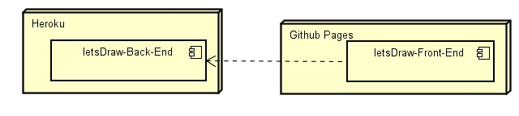

### diagrama de clases
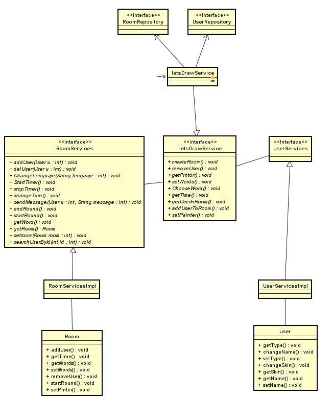

## Funcionamiento
### Vista principal
La primera vista que se muestra permite al usuario seleccionar un nombre y un personaje o skin, ***sin alguno de estos 2 elementos falta no se puede avanzar a la siguiente vista***.
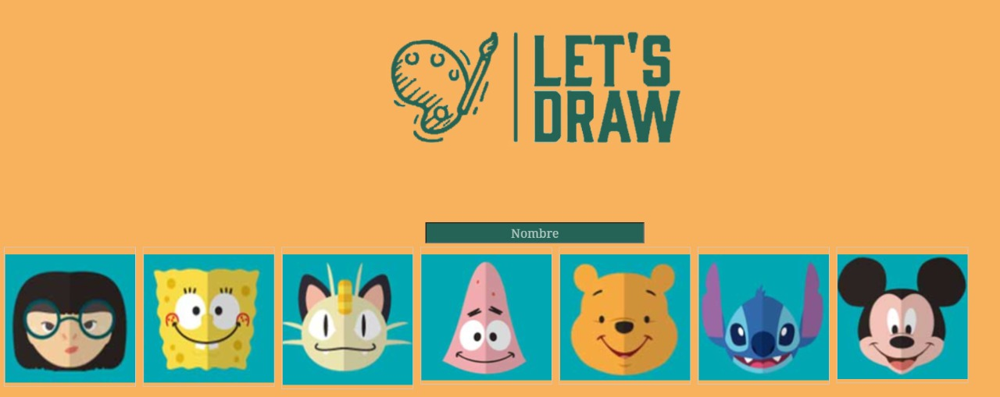
### Vista menú
Posteriormente nos dirige a la vista del menú, en esta se presentan 3 opciones como se muestra en la imagen.
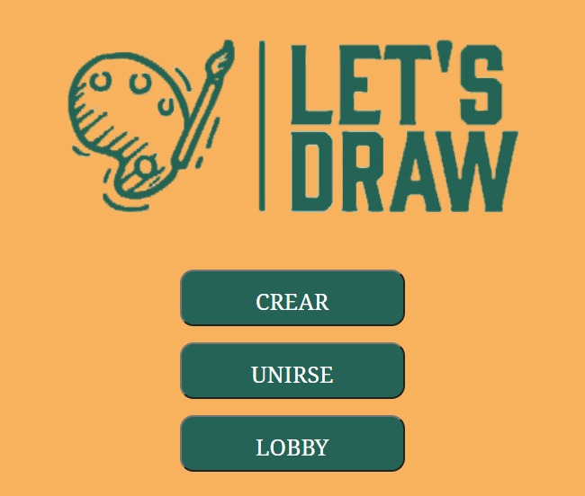

### Opcion menú: Crear Sala
La primera opción **CREAR** permite al usuario crear una sala con: nombre, lenguaje, # de jugadores y la posibilidad de ser privado.

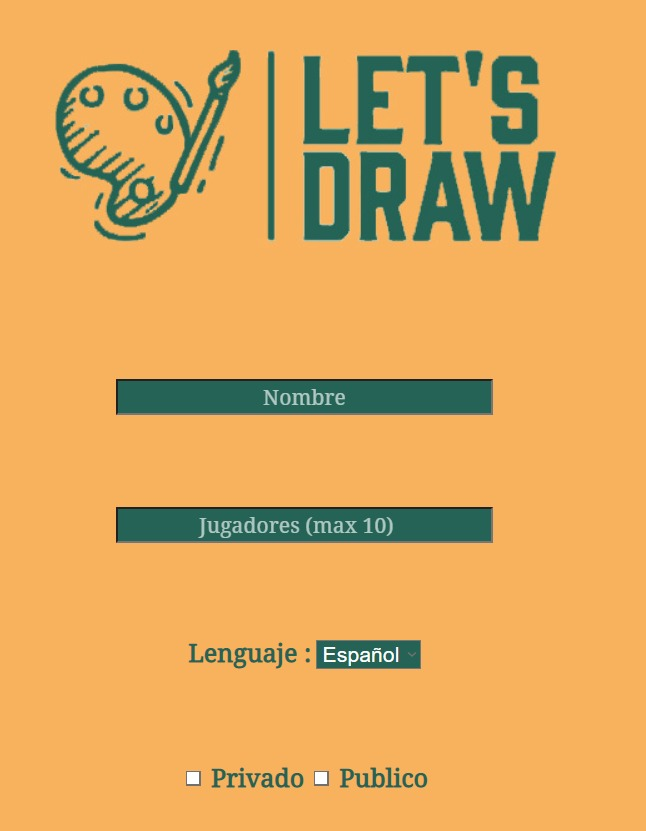

### Opcion menú: Unirse a sala
La segunda opción **UNIRSE** permite al usuario conectarse a una sala en especifico si conoce su numero de id.

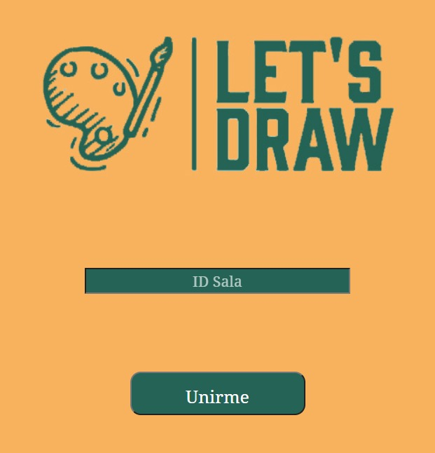

### Opcion menu: Lobby
Por ultimo la opción **LOBBY** despliega la lista de salas disponibles , además de esto permite ver las características de las mismas.

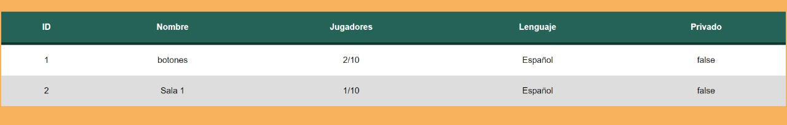

### Vista al interior de una sala
Cualquiera de las opciones anteriormente mencionadas redirecciona al usuario al interior de una sala , en esta se encuentra una lista de usuarios(parte izquierda) , un chat(parte derecha) y un tablero para dibujar en la parte central.

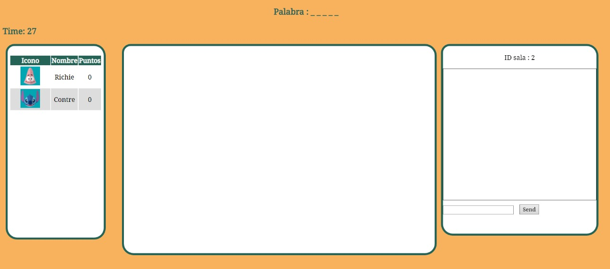
además de esto en la parte inferior se encuentran las opciones de salir de la sala, limpiar el canvas , el color y el grosor del pincel .

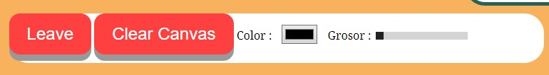
Por ultimo podemos ver, cada que se acaba una ronda, una imagen como la que se muestra a continuación.

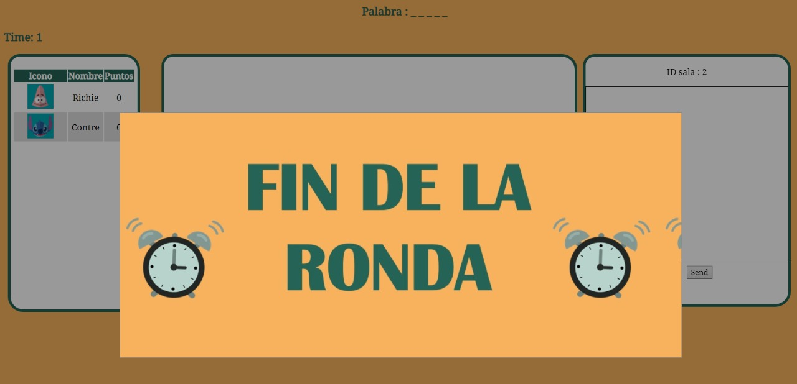

## Construido con

* [Java] (https://www.oracle.com/technetwork/java/javase/downloads/jdk8-downloads-2133151.html)
* [Maven] (https://maven.apache.org/)
* [Spring] (https://spring.io/projects/spring-boot)
* [AWS] (https://aws.amazon.com/es/)
* [Heroku] (https://www.heroku.com)

## Calidad de codigo y ci
### Back-end

### Front-end

# Licencia & Derechos de Autor

**©** Juan Sebastian Garcia Hincapie , Juan Pablo Contreras , Ricardo Amaya Rivera. [Escuela Colombiana de Ingeniería Julio Garavito](https://www.escuelaing.edu.co/es/)  
Licencia bajo la [GNU General Public License](/LICENSE).

